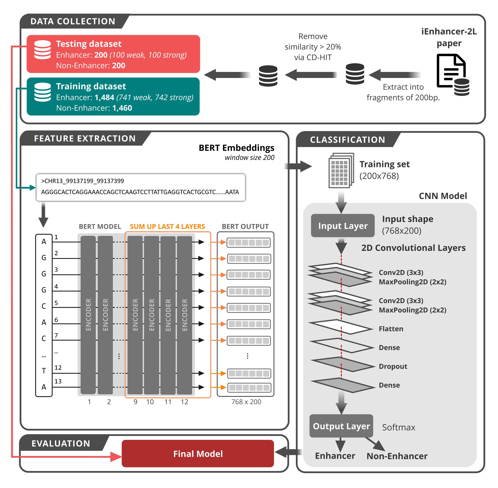

# Bert-Promoter
An improved sequence-based predictor of DNA promoter using BERT pre-trained model and SHAP feature selection

DNA promoters are crucial for precise regulation of gene expression, while their identification and strength prediction are challenging because of their free distribution and tremendous number of similar fractions in the genome. Although several bioinformatics tools have been developed, shortfalls in these models remain, and their performances need further improvement. Also, there has been no detailed investigation of transformer NLP model to improve this predictive performance. In the present study, a two-layer predictor was proposed based on BERT pre-trained model for identifying promoters (promoters or not) and their activities (strong and weak). More specifically, to build an efficient model, a pre-trained BERT model was employed to extract features from DNA sequences, and these features were assessed by SHAP analysis to look at the top-rank ones. Subsequently, the top features were inserted into different machine learning models to predict the outcomes. In the experiment, our final model achieved an accuracy of 85.5% and 76.9% for identifying promoters and their strength, respectively. The performance results also indicated that the proposed model outperformed state-of-the-art available toolkits.

## Step by step for training model
### Dependencies
- Python 3
- Tensorflow 1.x: https://www.tensorflow.org/
- BERT: https://github.com/google-research/bert

### Prediction step-by-step:
### Step 1
Use "extract_seq.py" file to generate JSON files
- *python extract_seq.py*

### Step 2
Use command line in "bert2json.txt" to train BERT model and extract features

### Step 3
Use "jsonl2csv.py" to transfrom JSON to CSV files:
- *python jsonl2csv.py json_file csv_file*

### Step 4
Use "xgb_training.py" to train XGB model from generated CSV files
